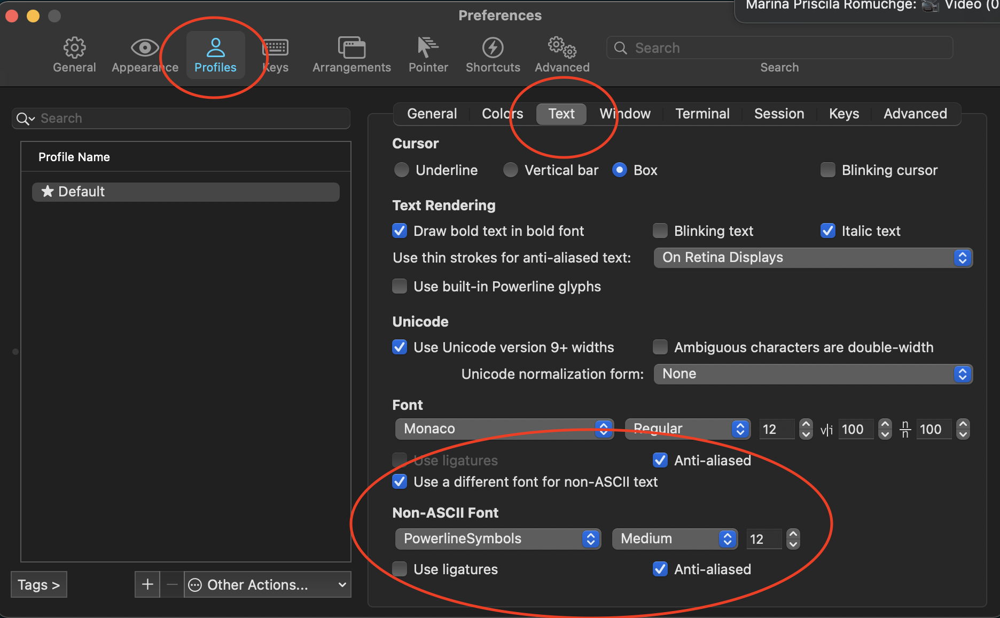

# Pre requisites
## Powerline

Follow instructions from the official website for installation. Available [here](https://powerline.readthedocs.io/en/master/installation.html). 

*Note: install Powerline for the user only, not system wide.*

## Tmux Plugin Manager

Follow installations instructions from [here](https://github.com/tmux-plugins/tpm).

## Powerline Font

May be installed using: `brew install homebrew/cask-fonts/font-powerline-symbols`

## iTerm2 configuration



## tmux-mem-cpu-load

```shell
brew install tmux-mem-cpu-load
```
